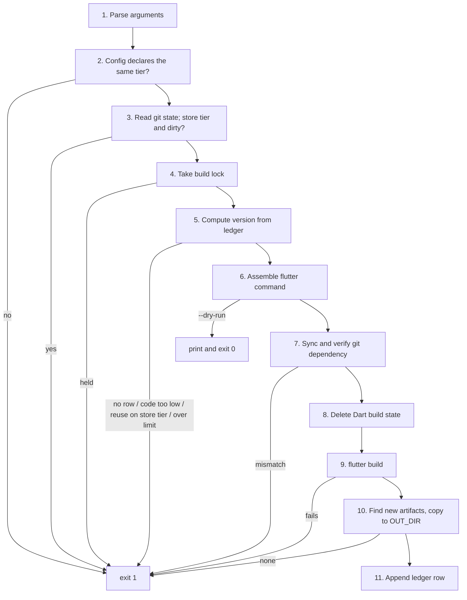

# 05 Anatomy of build.sh

The full script is [`template/tool/build.sh`](../template/tool/build.sh). This doc walks through it in order. Each section answers one question, and the order matters: nothing that changes files runs before every check that can refuse the build.

## Flow



Steps 1 to 6 change nothing in the project apart from creating the lock directory. Step 7 can rewrite `pubspec.lock`. Step 11 is the only step that writes the ledger, and it runs only after an artifact exists.

## Settings block

```bash
APP_SLUG=myapp            # used in artifact file names
DEFAULT_TIER=staging      # tier built when --tier is not given
STORE_TIERS="prod"        # tiers uploaded to a store: a code can never be reused
TIER_MECHANISM=flavor     # flavor: --flavor <tier>; property: -Ptier=<tier> (Android only)
TRACKED_GIT_DEP=""        # a git dependency that follows a branch; empty to disable
OBFUSCATE=1               # 1: --obfuscate --split-debug-info, symbols kept per build
MAX_CODE=2100000000       # Google Play's upper limit for versionCode
```

These are the only lines to edit when adopting the script. The default tier is the non-store tier: a bare invocation can never produce a production build.

```bash
set -euo pipefail
root=$(cd "$(dirname "$0")/.." && pwd)
cd "$root"
```

`-e` stops on the first failing command, `-u` on an unset variable, `pipefail` on a failure anywhere in a pipe. The script `cd`s to the project root so it works from any directory.

## 1. Arguments

```bash
target=$1; shift
case "$target" in
  apk|appbundle|ipa) ;;
  *) die "target '$target' is not supported; use apk, appbundle or ipa" ;;
esac
```

The first argument is the `flutter build` subcommand. Only targets that produce an artifact the script can find and record are accepted.

```bash
while [ $# -gt 0 ]; do
  case "$1" in
    --tier) tier=$2; shift ;;
    --bump) bump=1 ;;
    ...
    --build-name*|--build-number*|--flavor*|--dart-define-from-file*|--split-debug-info*|-Ptier*)
      die "'$1' is set by this script; remove it" ;;
    --split-per-abi)
      die "--split-per-abi stamps abi*1000+code, not the ledger's code. ..." ;;
    *) pass+=("$1") ;;
  esac
  shift
done
```

Three groups:

- **Own options** (`--tier`, `--bump`, `--reuse-code`, `--allow-dirty`, `--dry-run`) are consumed and never reach Flutter.
- **Owned flags** are refused. If the caller could also pass `--build-number`, the artifact would carry one number and the ledger another.
- **Everything else** (`--release`, `--target-platform`, `--no-tree-shake-icons`, ...) is passed through unchanged, so new Flutter flags work without editing the script.

`--split-per-abi` is refused because Flutter's Gradle plugin overrides each split APK's code to `abi × 1000 + code` (see [06](06-artifacts-and-symbols.md)).

```bash
config=$root/config/tiers/$tier.json
[ -f "$config" ] || die "no config for tier '$tier' (expected config/tiers/$tier.json)"
```

A tier exists if and only if it has a config file.

## 2. Config pairing

```bash
declared=$(sed -n 's/.*"APP_TIER"[[:space:]]*:[[:space:]]*"\([^"]*\)".*/\1/p' "$config" | head -1)
[ "$declared" = "$tier" ] || die "config/tiers/$tier.json declares APP_TIER='$declared', expected '$tier'"
```

Each config file states its own tier. `prod.json` created by copying `staging.json` and forgetting a field is caught before compiling. `sed` is used instead of a JSON parser so the script has no dependency beyond POSIX tools.

## 3. Source state

```bash
git_sha=$(git rev-parse --short HEAD 2>/dev/null || echo '-')
if [ -n "$(git status --porcelain 2>/dev/null)" ]; then
  git_sha="$git_sha+dirty"
  if [ "$is_store" = 1 ] && [ "$allow_dirty" != 1 ] && [ "$dry" != 1 ]; then
    die "uncommitted changes; a $tier build must come from a commit. ..."
  fi
fi
```

Read **before** step 7 rewrites `pubspec.lock` and step 11 appends to the ledger. Reading it at the end would mark every build `+dirty`, and the column would carry no information.

A store-tier build from uncommitted code cannot be reproduced, so it is refused unless `--allow-dirty` is passed. This also enforces committing the ledger: the previous build's row is an uncommitted change.

## 4. One build at a time

```bash
lock=$tool/.build.lock
mkdir "$lock" 2>/dev/null || die "another build holds $lock. If none is running, remove it."
stamp=$(mktemp)
trap 'rm -f "$stamp"; rmdir "$lock" 2>/dev/null || true' EXIT
```

Two builds started together would read the same ledger and take the same "next" code. `mkdir` is atomic on every POSIX filesystem and, unlike `flock`, exists on macOS. The lock is taken before the ledger is read. The `trap` removes it on any exit, including failure.

`stamp` is an empty file whose modification time marks the start of the build. Step 10 uses it.

## 5. Version from the ledger

```bash
row() { awk -F'\t' -v s="$tier" -v c="$1" '$1!~/^#/ && NF>=4 && $2==s {v=$c} END{print v}' "$ledger"; }
last_name=$(row 3)
last_code=$(row 4)
max_code=$(awk -F'\t' -v s="$tier" '$1!~/^#/ && NF>=4 && $2==s && $4+0>m {m=$4+0} END{print m+0}' "$ledger")
```

`awk` reads the tier's rows and keeps the last value of a column, or the highest code. Comment lines and short lines are skipped.

```bash
[ -n "$last_name" ] || die "no '$tier' row in tool/versions.tsv. ..."
```

No row means no known starting point. The script never invents one: on a store, a guessed code is either a rejected upload or a build every existing install refuses.

```bash
name=${VERSION_NAME:-$last_name}
echo "$name" | grep -Eq '^[0-9]+\.[0-9]+\.[0-9]+$' || die "versionName '$name' is not MAJOR.MINOR.PATCH"
```

The name format both stores accept.

```bash
if [ "$bump" = 1 ]; then
  code=$((max_code + 1))
else
  code=$last_code
  if [ "$is_store" = 1 ] && [ "$reuse" != 1 ]; then
    die "$tier is a store tier and $code is its last code. ..."
  fi
fi
[ "$code" -ge "$max_code" ] || die "$tier has already used code $max_code; refusing $code. Use --bump."
[ "$code" -le "$MAX_CODE" ] || die "code $code is above the store limit $MAX_CODE"
```

- `--bump` goes above the highest code ever used, not above the last one.
- A rebuild keeps the last code. On a store tier this needs `--reuse-code`.
- The code may never go below the highest the tier has used. Android refuses a downgrade on the device, with no signal at build time, so this line is the only place it can be caught.

## 6. The flutter command

```bash
cmd=(flutter build "$target")
cmd+=(${pass[@]+"${pass[@]}"})
cmd+=(--build-name="$name" --build-number="$code" --dart-define-from-file="$config")
if [ "$TIER_MECHANISM" = flavor ]; then
  cmd+=(--flavor "$tier")
else
  cmd+=(-Ptier="$tier")
fi
if [ "$OBFUSCATE" = 1 ]; then
  symbols=$out_dir/symbols/$APP_SLUG-$tier-v$name+$code
  cmd+=(--obfuscate --split-debug-info="$symbols")
fi
```

The command is built as a bash array, so arguments containing spaces survive intact. `${pass[@]+"${pass[@]}"}` expands to nothing when `pass` is empty; a bare `"${pass[@]}"` fails under `set -u` in bash 3.2.

One `--tier` value sets the flavor (application id, label, icon), the config file (backend URLs) and, through step 5, the version series.

`--dry-run` prints the command and exits here, before the lock or any write.

## 7. Tracked git dependency

```bash
if [ -n "${PIN_DEPS:-}" ]; then
  "$tool/sync-git-dep.sh" "$TRACKED_GIT_DEP" --pin
else
  "$tool/sync-git-dep.sh" "$TRACKED_GIT_DEP"
fi
dep_sha=$(awk ... pubspec.lock)
```

Adopts the branch head (or installs the pinned commit), verifies that the lock and the compiler agree, and reads the commit for the ledger. Details in [04](04-git-dependencies.md).

## 8. Fresh Dart compile

```bash
rm -rf .dart_tool/flutter_build build/app/intermediates/flutter
```

Forces the Dart compile to run. Without it, Gradle can skip the compile after a dependency moves and package the previous build's code. See [04, the stale compile](04-git-dependencies.md#the-stale-compile).

## 9. Build

```bash
"${cmd[@]}"
```

If Flutter fails, `set -e` exits here. No artifact is copied and no row is written.

## 10. Collect artifacts

```bash
while IFS= read -r -d '' f; do artifacts+=("$f"); done < <(
  find build/app/outputs/flutter-apk build/app/outputs/bundle build/ios/ipa \
    -newer "$stamp" -type f \( -name '*.apk' -o -name '*.aab' -o -name '*.ipa' \) \
    -print0 2>/dev/null || true)
[ ${#artifacts[@]} -gt 0 ] || die "flutter reported success but wrote no new .apk/.aab/.ipa. Nothing recorded."
```

- **By modification time, not by path.** Output paths change with the flavor (`app-prod-release.apk`, `bundle/prodRelease/`) and with flags. A path assembled from arguments breaks on the first flag the script did not anticipate.
- **Only in the three release directories.** Gradle also writes an APK copy under `build/app/outputs/apk/`; searching only `flutter-apk/` avoids filing the same APK twice.
- **Newer than the stamp.** An artifact left by an earlier build is never picked up.
- **Nothing new is an error.** If Flutter exits 0 and writes nothing, whatever is in `build/` is old.
- `-print0` with `read -d ''` handles any file name and needs no `xargs`, whose behaviour on empty input differs between GNU and BSD.

```bash
base=$APP_SLUG-$tier-v$name+$code
cp -f "$a" "$out_dir/$base.$ext"
```

The copy is named `myapp-prod-v1.4.2+58.aab`. Tier, name and code are in the name, so files from different tiers or codes never overwrite each other. A rebuild in place overwrites the earlier file of the same name and code, which is the same build of the same version.

## 11. Record

```bash
note=$(printf '%s' "${NOTE:--}" | tr '\t\n' '  ')
printf '%s\t%s\t%s\t%s\t%s\t%s\t%s\t%s\n' \
  "$(date +%Y-%m-%d)" "$tier" "$name" "$code" "$git_sha" "$dep_sha" "$filed_list" "$note" >> "$ledger"
```

Written last, so a row means an artifact exists. Tabs and newlines in `NOTE` would add columns or rows and corrupt every later read, so they are replaced with spaces.

The script ends by reminding you to commit `tool/versions.tsv` and `pubspec.lock`, and where the debug symbols are.

## Error messages

Every refusal names the problem and the fix. Compare:

```
build.sh: prod is a store tier and 58 is its last code. A store rejects a code it has accepted.
Use --bump. Use --reuse-code only if 58 was never uploaded.
```

with a store console rejecting the upload an hour later. Each `die` message should let someone who has never read the script fix the problem.

## Portability notes

| Construct | Why |
|---|---|
| `#!/usr/bin/env bash` | Arrays and `read -d` need bash, not `sh` |
| `${arr[@]+"${arr[@]}"}` | Empty arrays under `set -u` in bash 3.2 (macOS) |
| `mkdir` lock | `flock` is not on macOS |
| `find -print0` + `read -d ''` | `xargs -r` is GNU-only |
| `sed -n 's/.../p'`, `awk -F'\t'` | Same behaviour in GNU and BSD |
